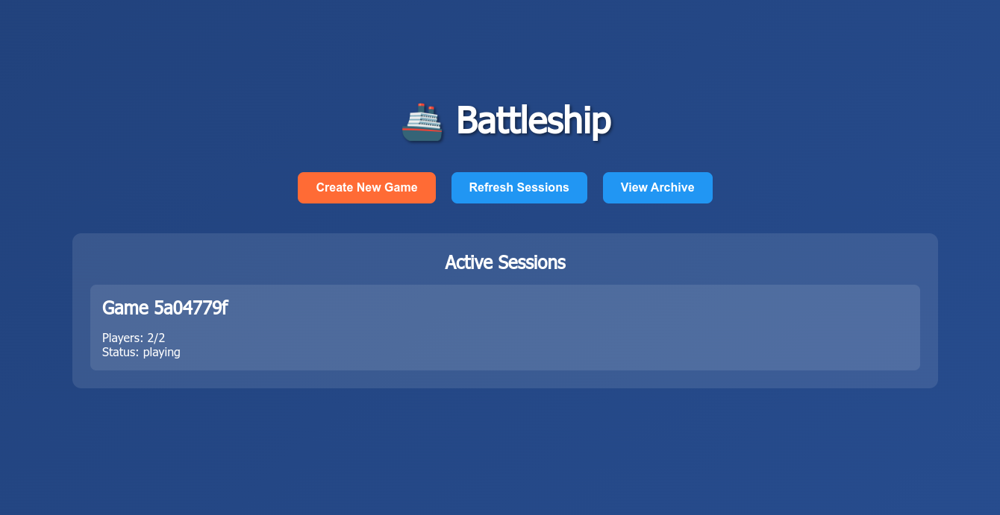

# 🚢 Web Battleship - Multiplayer Game



A feature-rich multiplayer browser-based implementation of the classic turn-based Battleship game using modern web technologies. Built with real-time WebSocket communication for seamless multiplayer gameplay.

## ✨ Features

### Core Gameplay
- **Real-time Multiplayer**: Two players can join and play simultaneously
- **Interactive Ship Placement**: Click-to-place ships with visual preview and validation
- **Turn-based Combat**: Classic Battleship rules with hit/miss/sunk feedback
- **Move Timer**: 30-second time limit per move with audio warnings
- **Sound Effects**: Audio notifications when it's your turn to fire

### Session Management
- **Auto-generated Session Names**: Descriptive naval-themed names (e.g., "Thunder-Squadron", "Steel-Armada")
- **Custom Session Names**: Edit auto-generated names or create your own
- **Active Sessions List**: View and join available games
- **Password Protection**: Optional password protection for private games
- **Invite Links**: Generate shareable links with embedded session details

### Enhanced UX
- **Player Name Display**: Names shown below each grid during gameplay
- **Host Controls**: Pause/resume game functionality for session creators
- **Visual Feedback**: Confirmation messages for ship placement and actions
- **Copy Invite Link**: One-click copying with visual feedback
- **Responsive Design**: Modern CSS Grid layout with beautiful gradients

### Game Management
- **Game Archive**: View history of finished and unfinished games
- **Player Statistics**: Track hits, misses, and accuracy percentages
- **Automatic Archiving**: Games saved when completed or abandoned
- **Session Recovery**: Handle player disconnections gracefully

## 🎮 Game Rules

1. **Fleet Composition**: Each player places 5 ships on a 10×10 grid:
   - **Carrier** (5 spaces)
   - **Battleship** (4 spaces) 
   - **Cruiser** (3 spaces)
   - **Submarine** (3 spaces)
   - **Destroyer** (2 spaces)

2. **Gameplay**: Players alternate turns firing at enemy grid coordinates
3. **Victory**: First player to sink all enemy ships wins!
4. **Time Limit**: 30 seconds per move with audio warnings at 10 seconds

## 🚀 Quick Start

### Prerequisites
- Node.js (v14 or higher)
- npm or yarn package manager

### Installation & Setup

1. **Clone or download the project**
   ```bash
   git clone <repository-url>
   cd web-battleship
   ```

2. **Install dependencies**
   ```bash
   npm install
   ```

3. **Start the server**
   ```bash
   npm start
   ```

4. **Open your browser**
   Navigate to `http://localhost:3000`

### Development Mode
For development with auto-restart on file changes:
```bash
npm run dev
```

## 🎯 How to Play

### Creating a Game
1. Click **"Create New Game"**
2. Auto-generated session name appears (editable)
3. Enter your player name
4. Optionally set a password for private games
5. Click **"Create Game"** to start

### Joining a Game
1. Select from **Active Sessions** list, or
2. Use an **invite link** shared by the host
3. Enter password if required
4. Enter your player name

### Ship Placement
1. Click on ships to select them
2. Click on grid to place selected ship
3. Use **"Rotate Ship"** to change orientation
4. Use **"Random Placement"** for automatic setup
5. Click **"Confirm Placement"** when ready

### Battle Phase
1. Wait for your turn (audio notification plays)
2. Click on enemy grid to fire
3. See immediate hit/miss feedback
4. Watch the 30-second timer
5. First to sink all enemy ships wins!

### Host Controls
- **Pause Game**: Temporarily stop the timer
- **Resume Game**: Continue from paused state
- **View Archive**: Check game history

## 🛠 Tech Stack

### Backend
- **Node.js**: JavaScript runtime environment
- **Express.js**: Web application framework
- **Socket.io**: Real-time WebSocket communication
- **File System**: JSON-based game archiving

### Frontend
- **Vanilla JavaScript**: ES6+ features, no frameworks
- **HTML5**: Semantic markup with modern standards
- **CSS3**: Grid layout, flexbox, gradients, animations
- **Web Audio API**: Sound effects and notifications
- **Clipboard API**: Copy invite link functionality

### Architecture
- **Real-time Communication**: WebSocket-based bidirectional messaging
- **In-memory Storage**: No database required, session-based state
- **Event-driven**: Socket.io event handlers for game logic
- **Modular Design**: Separated client/server concerns

## 📁 Project Structure

### Repository Files (Version Controlled)
```
web-battleship/
├── server.js                 # Main server file with game logic
├── package.json             # Dependencies and scripts  
├── LICENSE                  # MIT license
├── README.md               # This documentation file
├── .gitignore              # Git ignore rules
├── battleship-startpage.png # Game screenshot
└── public/
    ├── index.html          # Main HTML structure
    ├── game.js            # Client-side game logic
    └── styles.css         # CSS styling
```

### Runtime Files (Not Version Controlled)
These files are created automatically when you run the game:
```
├── node_modules/           # Dependencies (created by npm install)
├── game_archive.json      # Game history storage (created at runtime)
└── archived_games.json    # Alternative archive file name
```

> **📝 Note**: Game archives are saved locally in `game_archive.json` in the project root directory. This file contains the history of finished and unfinished games with player statistics and is automatically created when games are completed or abandoned.

## 🌐 Browser Compatibility

**Minimum Requirements:**
- WebSocket support
- ES6+ JavaScript (Arrow functions, const/let, etc.)
- CSS Grid and Flexbox
- Web Audio API (for sound effects)
- Clipboard API (for copy functionality)

**Tested Browsers:**
- Chrome 80+
- Firefox 75+
- Safari 13+
- Edge 80+

## 🔧 Configuration

### Environment Variables
- `PORT`: Server port (default: 3000)

### Game Settings (configurable in code)
- Move timer: 30 seconds
- Grid size: 10×10
- Ship sizes: [5, 4, 3, 3, 2]
- Audio warnings: 10 seconds remaining

## 🎨 Customization

### Adding New Session Name Themes
Edit the `generateSessionName()` function in `public/game.js`:
```javascript
const adjectives = ['Epic', 'Mighty', /* add more */];
const nouns = ['Fleet', 'Armada', /* add more */];
```

### Styling
Modify `public/styles.css` to customize:
- Color schemes
- Grid appearance
- Button styles
- Animations

## 🐛 Troubleshooting

### Common Issues
1. **Port already in use**: Change port in server.js or kill existing process
2. **WebSocket connection failed**: Check firewall settings
3. **Audio not playing**: Ensure browser allows audio autoplay
4. **Invite links not working**: Verify URL format and session ID

### Debug Mode
Enable console logging by uncommenting debug statements in:
- `server.js` (server-side events)
- `public/game.js` (client-side events)

## 🤝 Contributing

Feel free to submit issues, feature requests, or pull requests to improve the game!

## 📄 License

This project is open source and available under the MIT License.

---

**Enjoy commanding your fleet and may the best admiral win!** ⚓🎯

*Built with ❤️ using modern web technologies*
